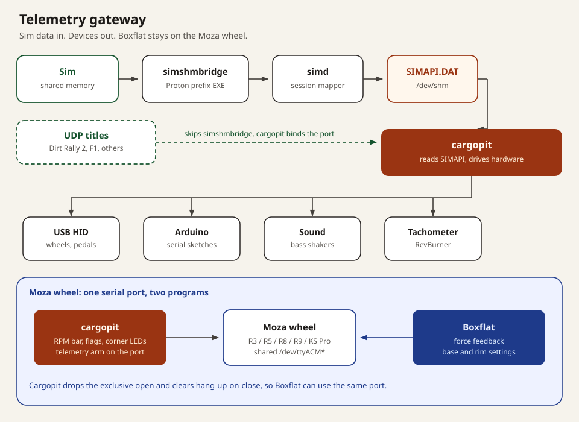
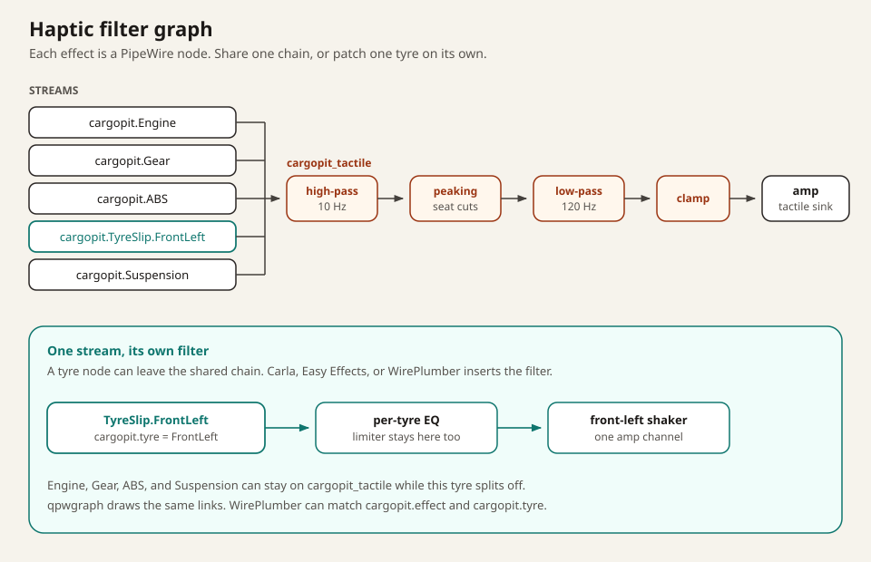
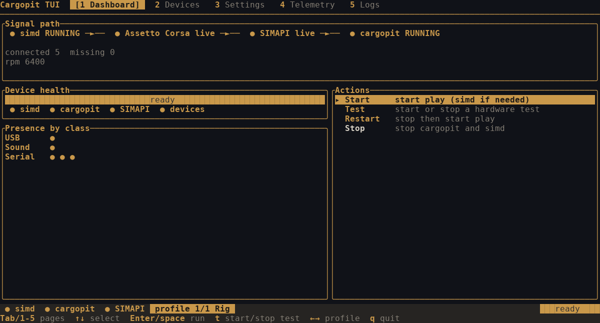
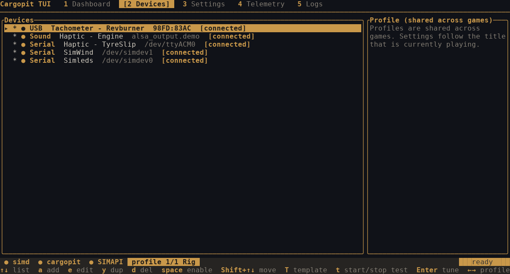
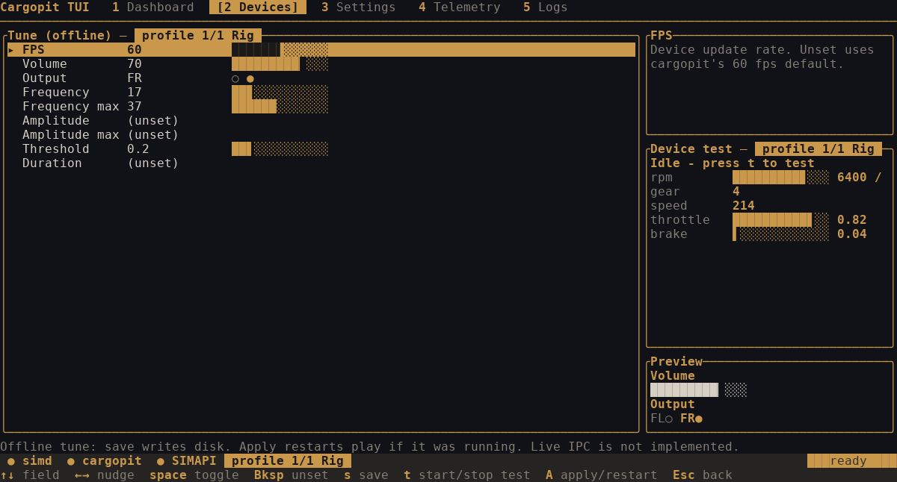
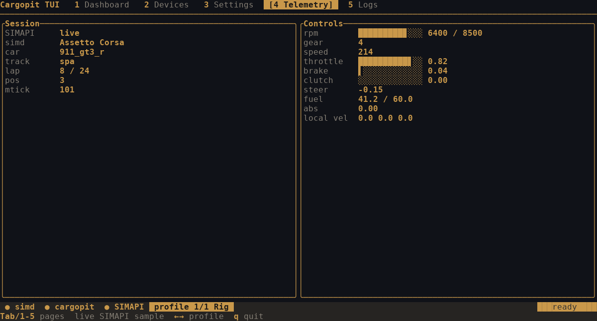
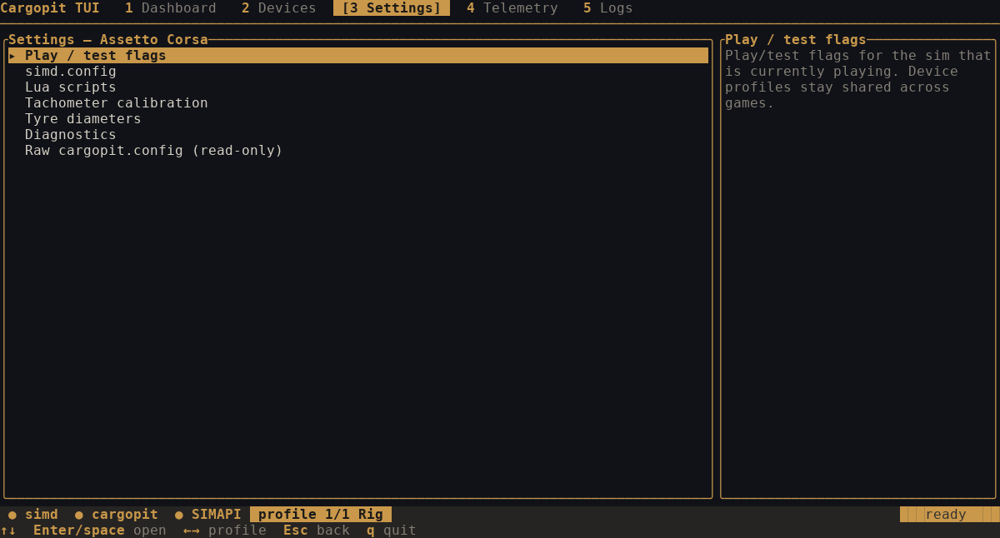

# Cargopit

Cargopit is a hard fork of [monocoque](https://github.com/Spacefreak18/monocoque).
This source was modified in 2026. Original copyright 2022 Paul Jones.
The program remains GNU GPL v3 or later; see [License](#license).

```text
░█▀▀░█▀█░█▀▄░█▀▀░█▀█░█▀█░▀█▀░▀█▀
░█░░░█▀█░█▀▄░█░█░█░█░█▀▀░░█░░░█░
░▀▀▀░▀░▀░▀░▀░▀▀▀░▀▀▀░▀░░░▀▀▀░░▀░
```

Linux device manager for driving and flight simulators. It reads live telemetry through the [simapi](https://github.com/spacefreak18/simapi) shared-memory API and drives USB HID, serial/Arduino, and PulseAudio (PipeWire) devices.

The whole project is being ported to Rust so the device manager is memory safe. AI generates the code, so the port has no extra cost. `./install.sh --from-source` installs the Rust host as `cargopit` and keeps the C host as `cargopit-legacy` until every current device and game path matches. The simapi mapper, the simd daemon, and the Arduino sketches stay C. Cargopit talks to them from Rust.

Usage docs for sims, bridges, and hardware: [spacefreak18.github.io/simapi](https://spacefreak18.github.io/simapi/). Device setup after the binaries exist: [HOW-TO-USE.md](HOW-TO-USE.md).

## Telemetry gateway

simd publishes one shared-memory record, `SIMAPI.DAT`. Cargopit is the gateway from that record to the rig: USB HID, Arduino serial, bass-shaker streams, and a RevBurner tachometer. Shared-memory titles in Proton (Assetto Corsa, ACC, AMS2, and the other Project CARS–family games) put a [simshmbridge](https://github.com/spacefreak18/simshmbridge) EXE in the game's prefix. UDP titles skip that bridge. Cargopit binds their ports when the sim uses UDP, and the same SIMAPI record still feeds the devices. Cargopit starts simd when it is installed and not already running.

On a Moza wheel the same serial port has two owners. Cargopit arms telemetry mode and writes the RPM bar, flag alerts, and corner LEDs. [Boxflat](https://github.com/Lawstorant/boxflat) keeps force feedback and base settings. Cargopit drops the exclusive open and clears hang-up-on-close so Boxflat can open the port as well. If that drop fails, the log says Boxflat may still contend for the wheel.



## Audio filters

Cargopit generates the haptic signal. Each effect is its own PulseAudio stream and its own PipeWire node, named `cargopit.<Effect>` or `cargopit.<Effect>.<Tyre>` (for example `cargopit.TyreSlip.FrontLeft`), with `cargopit.effect` and `cargopit.tyre` properties. Those nodes are how filters connect.

A shared chain is one virtual sink. Point the Sound device's device id at it and every effect on that device plays through the same filters, in order: 10 Hz high-pass, peaking cuts fitted to your seat, 120 Hz low-pass, then a sample clamp, then the tactile amplifier. The chain does not fall back to your speakers when the amplifier sink is missing.

A single node can leave that chain. Carla, Easy Effects, or a WirePlumber rule can pick up `cargopit.TyreSlip.FrontLeft` and send it through its own EQ into one shaker, while Engine, Gear, ABS, and Suspension stay on the shared sink. qpwgraph draws the same links by hand.



## Calibrating bass shakers

Seat response depends on the seat, the mount, and the amplifier. Cargopit does not ship a curve. Measure the seat, fit a filter, and keep both files with your own config.

1. Put the phone on the seat, in the phyphox experiment **Acceleration with g**.
2. Play a sine sweep through the shaker.
3. Export the sweep as a CSV with the columns `frequency_hz` and `transfer_db`.
4. From a source checkout, fit the filter and install it as a PipeWire drop-in. Replace the amplifier sink with the name from `pactl list short sinks`:

```bash
tools/haptics/fr_to_filterchain.py ~/.config/cargopit/seat-sweep.csv \
    --target-sink <amp sink from pactl list short sinks> \
    > ~/.config/pipewire/pipewire.conf.d/cargopit-tactile.conf
systemctl --user restart pipewire
```

The sink is named `cargopit_tactile`. The fit cuts towards the median level of the 32–120 Hz band and does not boost. It adds the 10 Hz high-pass, the 120 Hz low-pass, and the sample clamp from the diagram above. `--help` lists the target, resonance, cut, filter, and channel options. PipeWire 1.0 or newer is required. In the TUI, set the Sound device's device id to `cargopit_tactile`.

**Planned automation.** The sweep, the phyphox export, and the script are still a manual path. The project will take that path over: play the sweep on the shaker stream, import the `frequency_hz,transfer_db` CSV, fit the same filter graph, write the PipeWire drop-in next to the rig profile, and reload the sound device onto `cargopit_tactile`. The measurement still belongs to that seat. The generator will keep writing a curve for the rig you measured.

## How to install

Build from source. That compiles simapi, simd, and cargopit. It does not configure Steam, audio devices, or wheel firmware.

```bash
git clone https://github.com/M4X1K02/cargopit.git
cd cargopit
git submodule update --init --recursive
./install.sh --from-source
```

Run the script in a terminal so prompts work. Options include `--skip-bridges`, `--build-bridges`, `--deps-only`, `--detect-only`, `--force-native`, `--distrobox`, and `--allow-root`. See `./install.sh --help`.

When it finishes you have:

- `cargopit`, `start-cargopit`, `test-cargopit`, `start-simd`, and `cargopit-tui` in `~/.local/bin`
- `cargopit-legacy` when the C host was built
- configs in `~/.config/simd/` and `~/.config/cargopit/`
- an optional user unit `~/.config/systemd/user/simd.service`

Add `~/.local/bin` to `PATH` if the installer says it is missing. Compiler and library packages are listed under [Building](#building).

**Packages.** Pushing a version tag publishes builds to [Releases](https://github.com/M4X1K02/cargopit/releases):

- `.deb` for Ubuntu, Debian testing, and Debian stable. Each package depends on `libconfig11`.
- RPMs for Fedora 43 and Fedora 44. Nobara uses the Fedora RPM.
- an x86_64 AppImage
- a Flatpak bundle

simshmbridge is not in those packages. Use the [prebuilt compatibility EXEs](https://github.com/spacefreak18/simshmbridge/releases).

Release preparation and publishing steps are in [RELEASING.md](RELEASING.md).

**Bazzite / Silverblue / Steam Deck (immutable).** Do not layer this with `rpm-ostree`. Use the distrobox helper:

```bash
bash tools/distro/distrobox/install-distrobox.sh
```

This creates an Arch Linux container, installs simapi and simd, builds cargopit from source, and sets up wrapper scripts (`start-simd`, `start-cargopit`, `test-cargopit`, `cargopit-tui`) in `~/.local/bin/`. Uninstall with `bash tools/distro/distrobox/uninstall-distrobox.sh`.

**Supported games.** [Supported Sims](https://spacefreak18.github.io/simapi/supportedsims). On Linux some titles need a compatibility exe from simshmbridge. Follow the linked documentation for setup.

## How to use

Startup is the whole session. Cargopit starts simd, then you start the game.

1. Open a terminal and run `cargopit-tui`.
2. On the Dashboard, run **Start**. That launches `cargopit play`. The same launch is `start-cargopit` if you are not using the TUI.
3. Cargopit starts simd when the simd binary is installed and nothing is already serving `SIMAPI.DAT`. If simd is not installed, install it and start again. That is the one startup step that needs you.
4. Launch the game from Steam as usual.
5. Leave the TUI open. The health gauge is **ready** when simd, cargopit, live SIMAPI, and every configured device are up.

Shared-memory titles still need the bridge EXE in the Steam launch command, in the same Proton prefix as the game:

```bash
SIMD_BRIDGE_EXE=/home/YOU/.local/share/cargopit/simshmbridge/assets/acbridge.exe %command%
```

Exact EXE names: [simd usage](https://spacefreak18.github.io/simapi/simd_usage). Game toggles (AMS2 shared memory, and the rest) are in [HOW-TO-USE.md](HOW-TO-USE.md#steam--game-config).

Stop the session from the Dashboard, or with:

```bash
echo stop | socat - UNIX-CONNECT:$XDG_RUNTIME_DIR/cargopit.sock
```

`status` and `reload` use that same socket, one line in and one JSON line out. A hardware check of the devices listed in the config is `test-cargopit` or **t** in the TUI. Press **t** again to stop the test.

Logs: `~/.cache/cargopit/*.log`.

## cargopit-tui

`cargopit-tui` is the manager. It starts, tests, restarts, and stops the stack, edits one device profile shared across games, and follows the title that is actually running. Play and test flags, `simd.config`, Lua scripts, tachometer calibration, and tyre diameters are edited in the TUI. The on-disk config is shown read-only. Set `CARGOPIT_BIN` to the host the TUI should launch.

The frames below are the current UI with a sample profile and a sample SIMAPI session (Assetto Corsa on track, devices present, simd and cargopit running).

### Dashboard

The signal path is simd, the running sim, SIMAPI, then cargopit. The health gauge is **ready** only when all four are up: simd, cargopit, live SIMAPI, and every configured device present.



### Devices

One profile is the hardware map for every game. Add, edit, duplicate, disable, reorder, or insert a template. Per-device **t** runs `cargopit test` for that row.



### Tune

Sound rows show the speaker mask and the effect sliders (volume, frequency, threshold). EQ and limiting are not tuned here: route the device to a processor sink as in [Audio filters](#audio-filters). Save writes the config. Apply reloads the devices of a running play session through its control socket when that session plays the same profile, and restarts play otherwise.



### Telemetry

The Telemetry tab samples `SIMAPI.DAT`: session, rpm, gear, speed, and pedals.



### Settings

Settings follow the sim that is playing. The device profile does not. Flags, `simd.config`, Lua, tachometer XML, tyre diameters, diagnostics, and a read-only view of `cargopit.config` live here.



| Keys | Action |
| --- | --- |
| `1`–`5` or Tab | Dashboard, Devices, Settings, Telemetry, Logs |
| Enter | Run the selected action, or open tune |
| `t` | Start or stop a hardware test |
| `a` `e` `y` `d` | Add, edit, duplicate, delete a device |
| `T` | Insert a device template |
| `,` `.` | Previous or next profile |
| `q` | Quit |

## Features

- Update loop at 60 fps by default, up to 1000 fps (`play --fps` for telemetry, per-device `fps` in `cargopit.config`), with a modular USB, serial, and sound backend.
- Bass shakers over PulseAudio (including PipeWire's Pulse server): engine rumble, gear shifts, ABS, tyre slip/lock, and suspension. Per-device `enabled` and `streamVolume` keys in `cargopit.config`.
- USB haptic shakers with engine rumble mapped across the shaker band, plus chassis/tyre gating so effects stay off when the car is not rolling.
- Tachometers: Revburner only, including existing Revburner XML and `cargopit config tachometer` to write a calibration file.
- Serial output to Arduino and ESP32. Sample sketches for shift lights, simwind, and motor haptics live in `src/arduino/`. Custom serial devices use a [Lua payload format](https://spacefreak18.github.io/simapi/serial_custom).
- Wheels and pedals including Clubsport Elite V3, [Logitech G29](https://spacefreak18.github.io/simapi/logitechg29), Moza R3/R5/R8/R9/KS Pro, Cammus C5/C12, Simagic GT Neo / P1000, and Simnet. Full list: [third-party devices](https://spacefreak18.github.io/simapi/thirdpartydevices).

## Adding More Devices

If a device is not already supported, a USB HID pcap or a pull request with working code is the fastest path.

https://santeri.pikarinen.com/pages/usb_hid_reverse_engineering/

## Building

GCC 13+ is required (simapi uses C23 enum-with-underlying-type). Debian 12 ships GCC 12 and cannot compile current simapi; use Ubuntu 24.04, a newer GCC, or a release `.deb` when one is published.

This tree depends on the simapi shared-memory headers as a submodule. If they are missing after clone or pull:

```bash
git submodule sync --recursive
git submodule update --init --recursive
```

Then:

```bash
cmake -B build -DENABLE_TESTS=ON -DCMAKE_BUILD_TYPE=Debug
cmake --build build
cargo build --release -p cargopit
```

Useful CMake options: `ENABLE_TESTS`, `BUILD_SHARED`, `BUILD_TUI` (default ON; needs cargo), and `ENABLE_STATIC_ANALYSIS`. The CMake build produces the C host (`cargopit-legacy` once `install.sh` renames it). The Rust host is the cargo package `cargopit`.

### Dependencies

Vendored/static copies are listed so their licenses stay visible. PulseAudio is the sound backend.

- libserialport — Arduino / serial devices
- hidapi (hidraw) — USB HID
- libpulse — bass shakers and USB shaker streams
- libuv — event loop (C host)
- libxml2 — Revburner XML
- argtable2, libconfig, xdg-basedir, lua, libproc2 (or libprocps)
- rustc / cargo — Rust host and `cargopit-tui` (rustc 1.88+)
- [simapi](https://github.com/spacefreak18/simapi) (submodule)
- [slog](https://github.com/kala13x/slog) (static, in-tree, C host)
- [simshmbridge](https://github.com/spacefreak18/simshmbridge) — optional; shared-memory titles such as Assetto Corsa and Project CARS–related sims

**Arch**

```bash
pacman -S --needed git cmake base-devel curl libuv argtable libserialport libconfig hidapi lua54 libpulse pkgconf libxdg-basedir libxml2 yder procps-ng rust clang
```

**Fedora / Nobara**

```bash
dnf install git cmake gcc gcc-c++ make pkgconf-pkg-config curl libuv-devel argtable-devel libserialport-devel libconfig-devel hidapi-devel lua-devel libxdg-basedir-devel libxml2-devel pulseaudio-libs-devel procps-ng-devel cargo clang-devel libudev-devel
```

`yder-devel` (needed to build simd) is often missing from Fedora repos. `install.sh` builds yder from source when the package is absent. Extra packages: https://repo.spacefreak18.xyz/Packages/Fedora/43/

**Debian / Ubuntu / Mint**

```bash
apt install build-essential git cmake pkg-config cargo rustc libuv1-dev libargtable2-dev libserialport-dev libconfig-dev libhidapi-dev liblua5.4-dev libxdg-basedir-dev libxml2-dev libpulse-dev libproc2-dev libclang-dev libudev-dev
```

Use `liblua5.3-dev` if 5.4 is not in the repo, and `libprocps-dev` if `libproc2-dev` is absent. `libyder-dev` is similarly optional; the installer can build yder.

Ubuntu 24.04's default `cargo` / `rustc` packages are 1.75 and cannot build the Rust host or `cargopit-tui` (needs rustc 1.88+). `./install.sh` installs rustup when the distro toolchain is too old. For a manual build, install [rustup](https://rustup.rs/) or `rustc-1.89` first.

**openSUSE**

```bash
zypper install git cmake gcc gcc-c++ make pkg-config cargo rust libuv-devel argtable-devel libserialport-devel libconfig-devel hidapi-devel lua-devel libxdg-basedir-devel libxml2-devel libpulse-devel procps-devel clang-devel libudev-devel
```

## Testing

Automated suite (same as PR CI in `.github/workflows/pr-build.yaml`):

```bash
cmake -B build -DENABLE_TESTS=ON -DCMAKE_BUILD_TYPE=Debug
cmake --build build
ctest --test-dir build --output-on-failure --timeout 30
```

Rust host and `cargopit-tui`:

```bash
cargo test --workspace
cargo test --manifest-path tui/Cargo.toml
```

Hardware check (config must list only connected devices):

```bash
./cargopit test -vv
```

### Static Analysis

```bash
./tools/static-analysis.sh
```

This configures a C-only analysis build with GCC's `-fanalyzer`, high-signal
buffer and format warnings, and a first-pass audit for unsafe legacy C APIs.
Use `--strict` or `--ci` to make compiler warnings and unsafe-API findings
fail the command. `--ci` is what pull-request CI runs. The simapi submodule
is not part of that gate. `--skip-build` runs only the source audit.

Rust workspace analysis (Clippy with warnings denied, plus rustfmt):

```bash
./tools/rust-static-analysis.sh
```

Pull-request CI runs that command on the workspace, including `cargopit-tui`.

### Valgrind

```bash
cd build
valgrind -v --leak-check=full --show-leak-kinds=all --suppressions=../.valgrindrc ./cargopit play
```

## License

The program is GNU GPL v3 or later. Keep `LICENSE.rst` intact; that file is
the GPL text. Debian-format inventory of this tree and bundled works:
`tools/distro/debian/dpkg/copyright`.

| Component | License | Where |
| --- | --- | --- |
| cargopit (this fork) | GPL-3.0-or-later | `LICENSE.rst` |
| slog | MIT | `src/cargopit/slog/slog.h` |
| simapi (submodule) | LGPL-3.0 | https://github.com/Spacefreak18/simapi |
| Lua 5.4 | MIT | `packaging/licenses/lua-5.4-LICENSE.txt` |
| ratatui / crossterm (TUI) | MIT | Cargo crates linked into `cargopit-tui` |

## ToDo

- road and kerb sound haptic effects
- in-project bass-shaker calibration: play the sweep, import a phyphox CSV, write the filter-chain, reload the sound device
