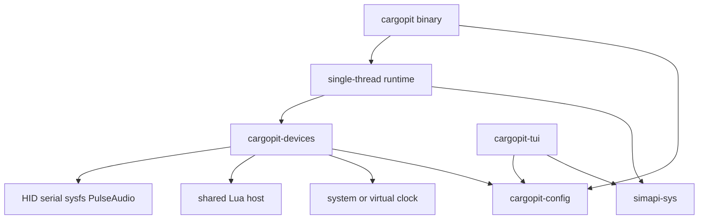

# Cargopit Rust port plan

## Goal and boundary

Port the host application in `src/cargopit/` to Rust without losing device or
game functionality. This is an incremental migration, not a rewrite-and-hope
cutover.

The port covers:

- The `cargopit` CLI, play loop, hardware test mode, tachometer wizard,
  configuration, logging, device backends, packaging, and CI.
- The existing Rust TUI, which becomes a workspace member and consumes the
  shared Rust crates.
- The automated tests and manual-test replacements needed to validate the
  migration.

The following remain C:

- The `src/cargopit/simulatorapi/simapi` submodule. A `simapi-sys` crate
  compiles the same mapper sources through `cc` and exposes them through
  generated `bindgen` bindings.
- The separate `simd` daemon, which remains the upstream C project.
- Firmware in `src/arduino/`. Rust mirrors its existing wire structs and
  protocols; it does not rewrite the firmware.

Keeping the simapi mapper implementation unchanged means direct shared-memory
and UDP game mapping uses the same code during the migration. The Rust runtime
must still test detection, shared-memory publication, stale-daemon fallback,
UDP routing, release, and rediscovery around that FFI boundary.

## What “guaranteed” means

Every existing device and game path gets three explicit evidence levels:

1. **CI parity:** Rust output is byte-identical to the current C output under a
   virtual clock, using committed scenarios and protected golden files.
2. **CI integration:** the real Rust binary runs through PTY, PulseAudio, UHID,
   shared-memory, or replayed UDP fixtures as appropriate.
3. **Hardware acceptance:** a maintainer tests every device they own with
   `cargopit test -vv` and a live `play` session. Devices without an available
   owner are explicitly marked as Level 1 + Level 2 only.

The Rust port reproduces current C behaviour, including quirks, until parity
is complete. Behaviour fixes are separate post-cutover changes recorded in
`docs/rust-port-known-quirks.md`.

## Target workspace

Create a root Cargo workspace with:

- `crates/simapi-sys`: compiles the same source list as
  `src/cargopit/simulatorapi/CMakeLists.txt`, binds `simdata.h`, `simmap.h`,
  and mapper APIs, and provides safe wrappers for mapping, publishing,
  clearing, and game detection. It uses `pkg-config` for libproc2 or the
  libprocps fallback and preserves the `USE_OLD_PID_VAL` compatibility rule.
  Build-time assertions must verify `sizeof(SimData) == 46044` and
  `SIMAPI_VERSION == 1` for the checked-out submodule.
- `crates/cargopit-config`: shared config parser and writer, enums and alias
  maps, device defaults, `simd.config` telemetry settings, paths, and tach
  XML. Move the existing parser from `tui/src/libconfig.rs` here, preserving
  the TUI's lenient value helpers while adding strict runtime accessors that
  match libconfig's type behaviour.
- `crates/cargopit-devices`: `SimDevice`, transport abstractions, all device
  encoders, haptic math, Lua host, and audio DSP. Encoders are pure functions
  wherever possible; real I/O is injected through transport traits.
- `crates/cargopit`: the `cargopit` binary, deterministic scheduler, game
  orchestration, CLI, test mode, tach wizard, logging, and simapi integration.
- Existing `tui/`: use the shared config and simapi crates and remove
  `tui/native/simapi_view.c` and its `cc` build shim after the replacement
  passes.

Use Rust edition 2021 and the existing TUI minimum Rust version (`1.88`).
Keep system dependencies for hidapi, PulseAudio, Lua, and proc2/procps.
Remove libuv, argtable2, libconfig, libxml2, libxdg-basedir, and
libserialport only after the cutover.

## Behaviour contracts

Before porting each subsystem, write a named test for these current contracts.

### Runtime and scheduling

- Device intervals use integer `1000 / fps` milliseconds. At the default 60
  fps, the interval is 16 ms, not a fractional 16.667 ms interval.
- Device timers start with an immediate tick. Telemetry mapping starts after
  2000 ms. Discovery and tyre-diameter checks use 1000 ms intervals.
- Test mode uses a 16000 microsecond tick; the embedded test loop uses 16 ms.
- Play mode runs the libuv loop on the main thread, and blocking serial writes
  block that loop. Preserve this ordering before considering asynchronous I/O.
- PulseAudio keeps its threaded mainloop; sound device updates only change
  sound state and the audio callback renders samples.
- A deterministic scheduler must run equal-due device timers in config order.
  Do not create independent Tokio intervals: missed ticks and task ordering
  would differ from libuv. Use a due-time heap keyed by `(due_ms,
  insertion_sequence)` and a clock read once per loop iteration.

### Mutable telemetry and shared state

- Devices receive `&mut SimData`: `hapticeffect.c` writes tyre diameters and
  `arduinoledlua.c` writes `mtick` in test mode.
- The scheduler owns the telemetry value and lends it to one device at a time;
  devices must not retain references across ticks.
- Preserve the process-global Moza-new LED state, the shared serial-port
  registry, and the process-once custom frequency-response table before
  attempting any cleanup.
- Keep HID selection semantics: the current code calls `hid_open(vid, pid,
  NULL)` and uses the first matching device; `devid` is ignored for HID.

### Numeric and time semantics

- Preserve C field and parameter types, including `float` versus `double`,
  small integer promotion, narrowing, implicit truncation, and `round()`
  semantics. Add scenarios for negative values, values above 16-bit limits,
  NaNs, and boundary thresholds.
- Implement Moza checksums with a widened wrapping accumulator followed by
  the same final narrowing as C.
- Route every monotonic or wall-clock read through the injectable `Clock`.
  This covers Moza 80/110 ms timing, ACR packet timing, and Lua's test-mode
  millisecond fallback. A CI check forbids direct clock calls outside the
  clock module.
- Sound DSP is 48 kHz S16LE with the existing smoothing, pulse, and phase
  behaviour. Compare PCM exactly with noise disabled; compare seeded statistical
  properties only for the current unseeded noise path.

### Config and Lua

- Runtime config access must be strict about numeric types, matching libconfig
  without `CONFIG_OPTION_AUTOCONVERT`: an integer does not satisfy a float
  lookup, and a float does not satisfy an integer lookup. Failed lookups retain
  C defaults rather than becoming new errors.
- Preserve case-insensitive aliases, profile-index semantics, missing/unknown
  tyre fallback to `ALLFOUR`, serial/USB enum offsets, and all existing
  filenames and directories.
- The shared Lua host must expose exactly the current fields and functions:
  `simdata`, `TotalLeds`, `RED`, `GREEN`, `BLUE`, `YELLOW`, `ORANGE`,
  `myFunc`, `Message`, the LED color/range functions, and `led_clear_all`.
  Integer fields (`rpm`, `gear`, `velocity`, `mtick`, flags, and proximity
  coordinates) must remain Lua integers; pedal, fuel, boost, and tyre values
  must remain Lua numbers.
- Preserve the serial-only `led_clear_range` registration quirk, where it
  calls the same implementation as `led_clear_all`, and the Lua 5.5 selected
  library opening path.

### Wire and process contracts

- HID buffers include their report ID as byte zero and pass the full C buffer
  length, including trailing zeros.
- Arduino data is sent as raw fixed-size structs. Rust serializers must use
  explicit field order and size assertions rather than unchecked transmute.
- ACR packets are packed little-endian; parse fixed offsets with explicit
  little-endian conversions.
- `SimData` is accessed only through generated simapi bindings, not a
  handwritten Rust layout.
- Preserve the binary name `cargopit`, companion names `simd` and
  `cargopit-tui`, CLI subcommands, underscore-containing flags, help/version
  exit behaviour, log stream, slog tags, and `test step: ` output.
- Preserve `/dev/shm/SIMAPI.DAT` publication for direct mapping, ACR bridge
  writes, and test mode; release must zero RPM and velocity, perform the final
  update/free, and then allow rediscovery.

## Parity harness

Build the harness before changing the implementation:

- `crates/parity/src/scenarios.rs` is the single scenario source. It produces
  raw `SimData` streams for RPM, gear, slip, lock, ABS, suspension, flags,
  brake temperature, velocity, blink, radar, sim on/off, frozen telemetry, and
  the existing basic/wheel-spin/wheel-lock fixtures.
- `tests/parity/c_capture/` links the unmodified C implementation and
  intercepts HID open/write/feature reports, serial open/read/write/wait,
  sysfs file writes, PulseAudio writes, `clock_gettime`, `gettimeofday`, and
  `usleep`. It supplies fake replies such as the SimLED `ledsc` count.
- A virtual clock makes captures deterministic. A C self-check must regenerate
  the same output twice.
- Golden files are readable text at
  `tests/parity/golden/<device>__<scenario>.golden`, with tick, virtual time,
  operation, and bytes or path/value on each line.
- Rust runs the same scenario through fake transports and compares every line
  exactly. Goldens are regenerated only by
  `tests/parity/regen-goldens.sh` while the C implementation exists.
- CI rejects golden-file edits unless the change is explicitly marked for
  regeneration and the regeneration script was run against C. Tests may not
  be skipped or marked ignored to obtain a green result.
- Config parity dumps C's parsed device and haptic settings to JSON and
  compares aliases, missing values, invalid granularity, strict numeric type
  mismatches, volume precedence, and out-of-range profile indexes.
- CLI contract tests run against both C and Rust using `CARGOPIT_BIN`, covering
  exit codes, help/version, missing simd, log tags, test-step output, and the
  exact flags spawned by the TUI.

## Existing-device coverage

Each row is a separate parity and integration gate.

### USB

- RevBurner tachometer, including XML pulse maps, `use_pulses`, granularities
  1/2/4, and zero-on-free.
- Cammus C5 and C12, including C12 default reports and Lua LED reports.
- Logitech G29 RPM LEDs, preserving current threshold and trailing-byte quirks.
- Simagic GT Neo Lua reports, 73 LEDs, and chunked `0xF0` feature reports.
- Fanatec CSL Elite V3 sysfs rumble for slip, lock, ABS, and off.
- Simagic P1000 initialization, lock/slip/ABS, and stop reports.
- SimNet pedals, including motor offsets and effect parameters.

### Serial

- ShiftLights, SimWind, SerialHaptic, SimLED, SimLED custom, and
  ArduinoCustom, including LED-count query timeout and Lua messages.
- Moza R5/R3/R8.
- Moza-new/R9 framing, stuffing, checksum, arm sequence, color tables, baud
  floor, hysteresis, 80/110 ms timing, and button spacing.
- Moza KS Pro yellow flag, color initialization, and `mtick` blink.
- Two devices sharing one serial port, including first-open baud semantics.

### Sound and haptics

- Engine, Gear, Slip, Lock, ABS, and Suspension effects.
- Custom and human frequency-response tables, pan, channel masks, volume,
  mute, and noise.
- Haptic slip/lock/ABS/suspension math, tyre selection, frozen telemetry,
  tyre-diameter measurement, and `diameters.config` round trip.
- A real PulseAudio or PipeWire smoke test must exercise the Rust transport,
  callback locking, sink-input mute, and stream writes.

### Game paths

The mapper code remains in simapi, but runtime orchestration is tested for:

- simd `SIMAPI.DAT`, including the 50 ms stale-`mtick` direct-mapping retry.
- Direct shared memory for AC/ACC/AC Evo/ACR, rFactor2/LMU, PCars2/AMS2,
  RaceRoom, and ETS2/ATS.
- UDP for Dirt Rally 2, F1, OutGauge, Wreckfest 2, Richard Burns Rally,
  Forza, and the ACR bridge.
- ACR's 48-byte `ACRM` packet, port 20999, redline floor, idle default,
  brake temperatures, and shared-memory publication.
- Maintainer-supplied captures: short DR2, F1, ACR, and OutGauge packets,
  plus one shared-memory snapshot per direct-SHM family. Synthesized fixtures
  are additional coverage, never the only game evidence.

## Protocol references and licensing

Create `docs/protocol-references.md` alongside the harness. For each
peripheral, record the source URL, license, commit/date reviewed, claimed
wire format, and agreement with the C golden output.

Use independent references to validate captures, never to override the C
contract during the port:

- Moza: [Boxflat](https://github.com/Lawstorant/boxflat) and
  [moza-simhub-plugin](https://github.com/giantorth/moza-simhub-plugin).
- Fanatec: [hid-fanatecff](https://github.com/gotzl/hid-fanatecff).
- Logitech: the Linux `hid-lg4ff` driver and
  [new-lg4ff](https://github.com/berarma/new-lg4ff).
- Cammus: [cammus-simhub-plugin](https://github.com/giantorth/cammus-simhub-plugin)
  and Boxflat issue #9, noting that the former derives from monocoque.
- Thrustmaster: [thrustmaster-led-linux](https://github.com/wKoja/thrustmaster-led-linux)
  and [hid-tmff2](https://github.com/Kimplul/hid-tmff2).
- Simagic: record that no complete public reverse engineering was found for
  the P1000 haptic reports or GT Neo LED feature reports.

Only protocol facts may be reimplemented. Do not copy code from GPL-2.0-only
kernel drivers or unlicensed projects into this GPL-3.0-or-later repository.
If a reference disagrees with a C golden, retain the C behaviour and add the
disagreement to the quirk log.

## Migration phases and exit criteria

Each phase is a separate PR with one owner and no unrelated cleanup.

1. **Harness:** add the workspace skeleton, minimal simapi layout checks,
   scenario generator, C capture harness, protected golden format, protocol
   catalogue, parity CI job, clock grep check, and UHID capability probe.
   The maintainer reviews the harness and compares at least one golden per
   device family with real captures before porting starts.
2. **simapi-sys and TUI:** bind the complete mapper source set, add safe
   wrappers and layout assertions, move the TUI to the shared crate, remove
   `tui/native/`, and pass TUI tests.
3. **Configuration:** port the parser/writer, strict runtime accessors,
   aliases, defaults, paths, tach XML, and simd telemetry settings. Port
   config and telemetry tests and make the TUI use the shared crate.
4. **Device core:** add `SimDevice`, deterministic clock, fake transports,
   HID/serial/sysfs/Pulse transports, shared Lua host, and haptic math. Pass
   haptic, Lua sample, transport, and real-audio smoke tests.
5. **USB:** port every USB backend and pass all USB goldens.
6. **Serial:** port every Arduino and Moza backend and pass serial goldens,
   including shared-port and timeout paths.
7. **Sound:** port DSP and effect devices; pass exact state/PCM gates and
   real-server smoke tests.
8. **Runtime and CLI:** port scheduling, game orchestration, UDP/ACR,
   simd startup, test mode, tach wizard, logging, and CLI. Pass all contract
   and game replay tests against both binaries.
9. **Shadow release:** package Rust as `cargopit` and C as
   `cargopit-legacy`; allow the TUI to select `CARGOPIT_BIN`; run virtual
   device/game jobs and the complete hardware checklist. Do not proceed with
   cutover while any Level 1 or Level 2 gate is red.
10. **Cutover:** update `install.sh`, `.cursor/install.sh`, workflows,
    Flatpak, Arch, Fedora, Debian, TUI lookup, docs, and static analysis.
    Verify a tagged package build, then delete the C host, CMake targets,
    slog, and the capture harness. Retain Rust goldens and parity tests.

If a golden mismatch remains unexplained after two focused attempts, stop the
task and report the diff and hypothesis. Do not alter the scenario or golden
file to force success.

## Post-cutover fixes and expansion

Do not mix new-device work with parity migration. After cutover, address
known quirks in separate PRs:

- G29 trailing byte and unreachable threshold.
- Serial `led_clear_range` behaviour.
- Process-global Moza state.
- HID device selection by path for multiple identical peripherals.

Then consider these candidates, each requiring reference-derived vectors,
Level 2 virtual-device coverage, and a named Level 3 tester. Until sign-off,
the device remains `experimental` in config and the TUI:

- Fanatec CSL Elite wheelbase rumble and kernel LED RPM outputs.
- Logitech G923 PlayStation/PC and G27 LED support. G920 and Xbox/PC G923
  HID++ support is out of scope initially.
- Thrustmaster rim RPM LEDs for T300RS, TX, TS-PC, TS-XW, T248, and T818.
- More Moza rim/dashboard commands.
- SimHub Standard HID LED (`0x68`), motor (`0x6A`), and fan backends.
- PXN V12 Lite RGB LEDs (`11FF:1112`), initially experimental because the
  public reference covers one physical unit.

No new Simagic P1000 haptic or GT Neo LED support is claimed without captures
and independent reverse engineering.

## Risks and controls

- **Harness validates the wrong thing:** independent protocol references,
  real-capture review, self-determinism, and protected goldens.
- **Scheduler drift:** one deterministic scheduler, virtual-clock tests, and
  explicit integer intervals.
- **C/Rust numeric drift:** typed field mapping, boundary scenarios, and
  exact byte comparison.
- **Config incompatibility:** strict runtime accessors and a broad edge-case
  corpus; no new validation where C silently keeps defaults.
- **Lua formatting drift:** explicit integer/float pushes and every sample
  script in parity tests.
- **Audio deadlocks:** pure DSP tests plus a real-server callback smoke test.
- **Hosted CI cannot create UHID devices:** probe in PR1 and use a self-hosted
  runner if required.
- **No hardware owner:** keep the device visible as Level 1 + Level 2 only;
  do not describe it as fully guaranteed.
- **Scope drift:** one phase per PR, no redesign during parity, and separate
  post-cutover fixes.
